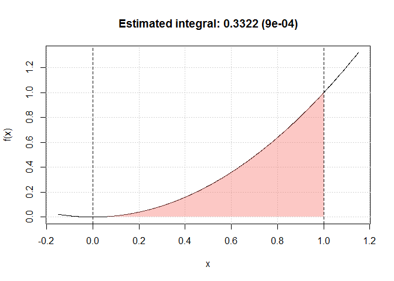

# Monte Carlo Integration

Can integrate functions…

# Instalations

``` r
devtools::install_github(ErickLeyC/R-package)
```

# What it does

``` r
library(Class)
obj = mc_int(x_range = c(0,1), fun = "x^2", B = 10^5)
plot(obj)
```

<!-- -->
